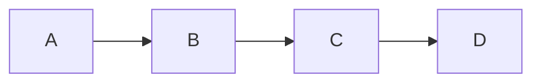
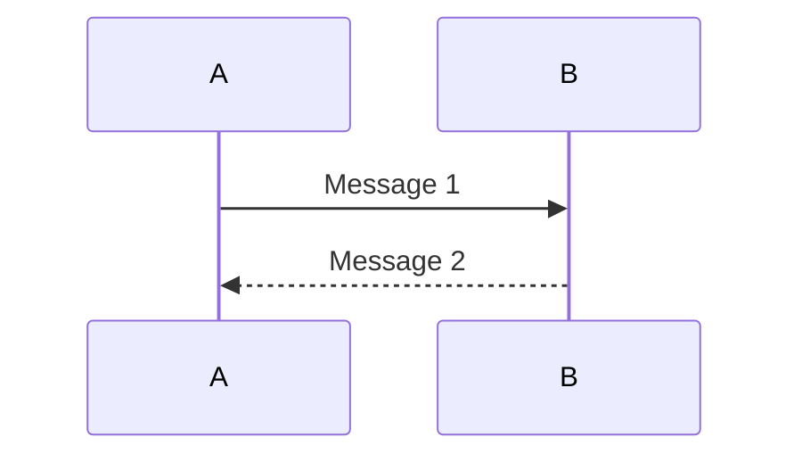
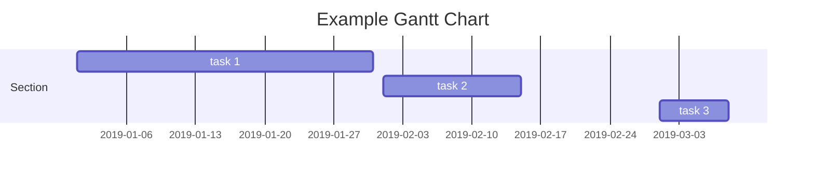
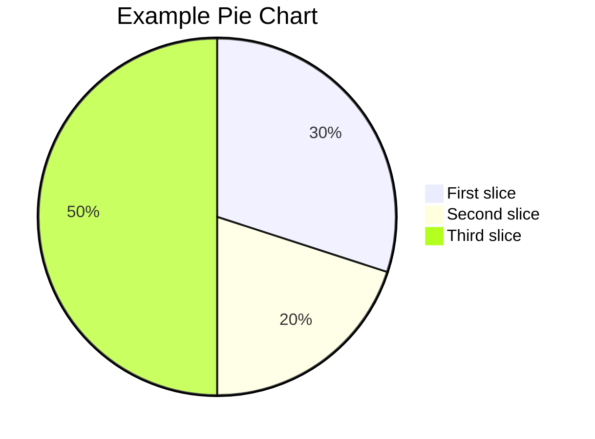
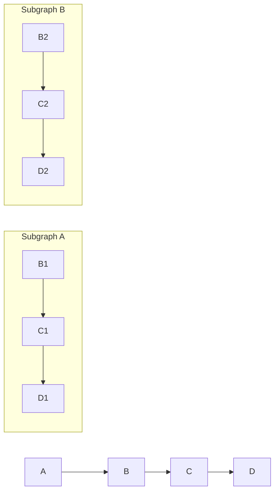
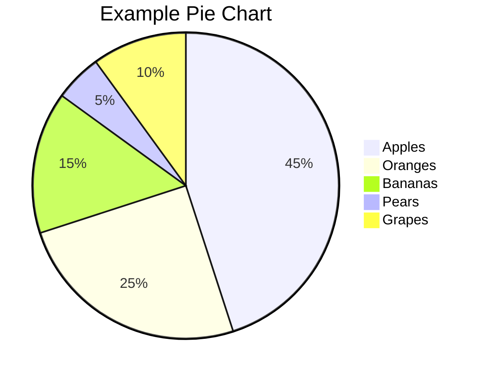
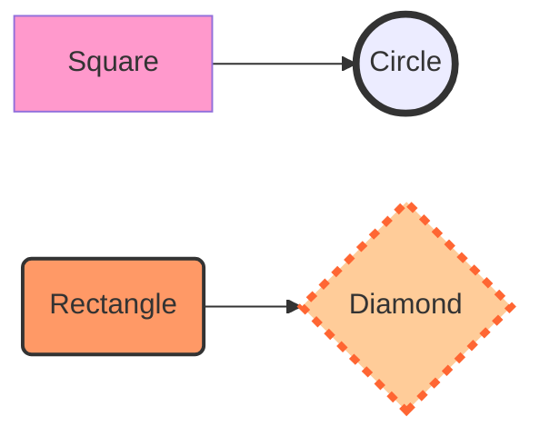

Mermaid 支持多种类型的图表

1.流程图（Flowchart）：展示过程、决策和操作流程。
```
graph LR
   A-->B;
   B-->C;
   C-->D;
```


在上面的示例中，graph 关键字用于定义一个图表，LR 参数指定图表方向为从左到右。然后，我们定义了四个形状 A、B、C 和 D，并使用 --> 符号连接它们，表示形状之间的流程顺序。

2.序列图（Sequence Diagram）：展示对象之间的交互顺序。
```
sequenceDiagram
   A->>B: Message 1
   B-->>A: Message 2
```

在上面的示例中，sequenceDiagram 关键字用于定义一个序列图。然后，我们定义了两个对象 A 和 B，并使用 ->> 和 -->> 符号连接它们，表示对象之间的消息传递顺序。消息文本可以放在冒号后面。

3.甘特图（Gantt Chart）：展示项目计划和进度。
```
gantt
   title Example Gantt Chart
   dateFormat  YYYY-MM-DD
   section Section
   task 1: 2019-01-01, 30d
   task 2: 2019-02-01, 14d
   task 3: 2019-03-01, 7d
```

在上面的示例中，gantt 关键字用于定义一个甘特图，title 用于定义图表标题，dateFormat 用于定义日期格式。然后，我们定义了一个部分 Section，并定义了三个任务 task 1、task 2 和 task 3，并指定了它们的开始日期和持续时间。


4.词云图（Class Diagram）：展示类的结构和关系。

5.饼图（Pie Chart）：展示数据占比。
```
pie
   title Example Pie Chart
   "First slice": 30
   "Second slice": 20
   "Third slice": 50
```

在上面的示例中，pie 关键字用于定义一个饼图，title 用于定义图表标题。然后，我们定义了三个数据点，分别为 "First slice"、"Second slice" 和 "Third slice"，并指定它们的数值。

捷径图（Shortcut）：简单展示快捷方式。

状态图（State Diagram）：展示对象状态的转换。

用户旅程图（Journey）：展示用户如何与应用程序交互。

Mermaid 语法高级版

常见的关键字或符号,用于定义图表的形状、连接和标签。
graph：定义一个图表。

subgraph：定义一个子图表，用于将多个形状分组。

pie：定义一个饼图。

--> 或 -|>：定义两个形状之间的连接，--> 表示直线连接，-|> 表示垂直连接。

--- 或 --：定义形状之间的水平或垂直线条。

=> 或 ==>：定义形状之间的带箭头的连接线，=> 表示直线箭头，==> 表示双线箭头。

class 或 interface：定义一个类或接口形状。

participant：定义一个参与者形状。

note：定义一个注释形状。

title：定义图表标题。

style：定义形状的样式。

click：定义一个可以单击的形状。

loop 或 alt：定义一个循环或条件块。

activate 或 deactivate：定义对象的激活或停用状态。

subroutine：定义一个子程序。

除此外，Mermaid 还支持更多的关键字和符号，用于定义甘特图、状态图、用户旅程图等特定类型的图表。

graph和subgraph
以下是使用Mermaid中的graph和subgraph关键字的示例：

在上例中，我们使用了graph创建了一个流程图。
接下来，我们用subgraph创建了两个子图表subgraph A 和 subgraph B ,用于将多个开关分组。
注意，子图表中定义的开关只能在该子图表中使用，不能在其他子图表或者图表中使用。
使用graph和subgraph可以帮助我们更好地组织和管理复杂的流程图，将相关的开关分组并以更清晰的方式呈现。

pie
在Mermaid中，可以使用pie关键字来创建饼图。饼图用于展示数据占比。
以下是一个示例：

在上面的示例中，我们使用pie关键字创建了一个饼图，title用于定义图表标题，"Apples":45.0表示Apples占比45%，依次类推。

连接类型
在Mermaid中，可以使用不同的符号来定义连接的类型。
* -->或者-|>:定义从一个节点到另一个节点的直线或者垂直线连接。
  ```mermaid
     graph LR;
     A-->B;
     C-->D;
  ```
* ---或者--:定义从一个节点到另一个节点的水平线连接。
  ```mermaid
     graph LR;
     A---B;
     C---D;
  ```
* 此外，还可以改变箭头的方向。
   1. 右箭头：A-->B;
   2. 左箭头：A<--B;
   3. 双向箭头：A<-->B;
   4. 右箭头带空心三角形：A--|>B;
   5. 左箭头带空心三角形：A<|--B;
   6. 双向箭头带空心菱形：A--OB;
   7. 自我引用带圆形箭头：A==>A;
  ```mermaid
     graph LR;  
     A<-->B;
  ```
使用连接符时，根据业务需求，选择合适的连接方式。还可以使用style为连接设置样式。
  
style

在Mermaid中，可以使用style关键字来为图形设置样式。
```
style <shape-id><style-attr>:<style-value>[,<style-attr>:<style-value>];
<shape-id><style-attr>:<style-value>[,<style-attr>:<style-value>];...
```
shape-id是形状的ID，style-attr是样式属性，style-value是样式值。是以为形状设置多个样式属性，多个样式属性之间用逗号分隔,多个图形之间用分号分隔。
以下为一个示例。

fill：填充颜色。
stroke：边框颜色。
stroke-width：边框宽度。
stroke-dasharray：边框虚线。

除了这些属性外，还可以使用其他属性来设置样式。font-size、font-weight、font-family、text-align、text-decoration等。

还可以使用style为图形设置大小。要设置形状的大小，还可以使用width和height属性。

loop和alt

在Mermaid中，可以使用loop和alt关键字来定义循环和条件块。
loop: 定义一个循环块。可以让一组形状重复多次。语句如下：
```
loop [循环次数]
  [形状1]   
  [形状2]   
  ...
end
```
alt: 定义一个条件块。可以让一组形状根据条件执行。语句如下：
```
alt [条件1]
  [路径1] 
else if [条件2]  
  [路径2]
else
  [路径3]
end
```
在上面的语法中，alt 关键字后面可以跟一个可选的条件，表示条件块的条件。然后，我们可以定义多个路径，表示根据条件选择的不同路径。else if 和 else 是可选的，可以定义多个条件和路径。

