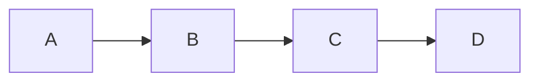
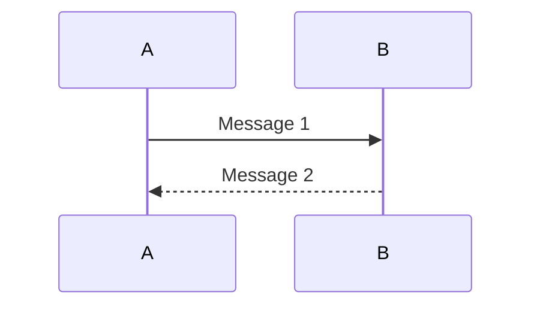
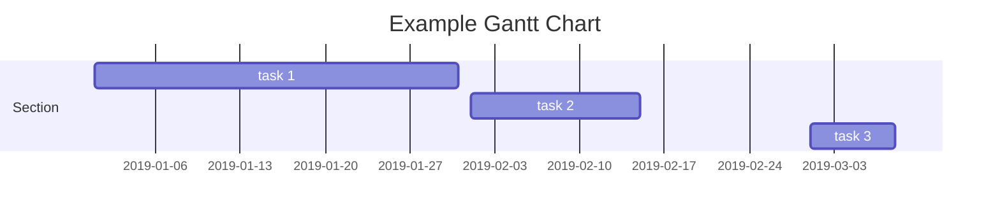
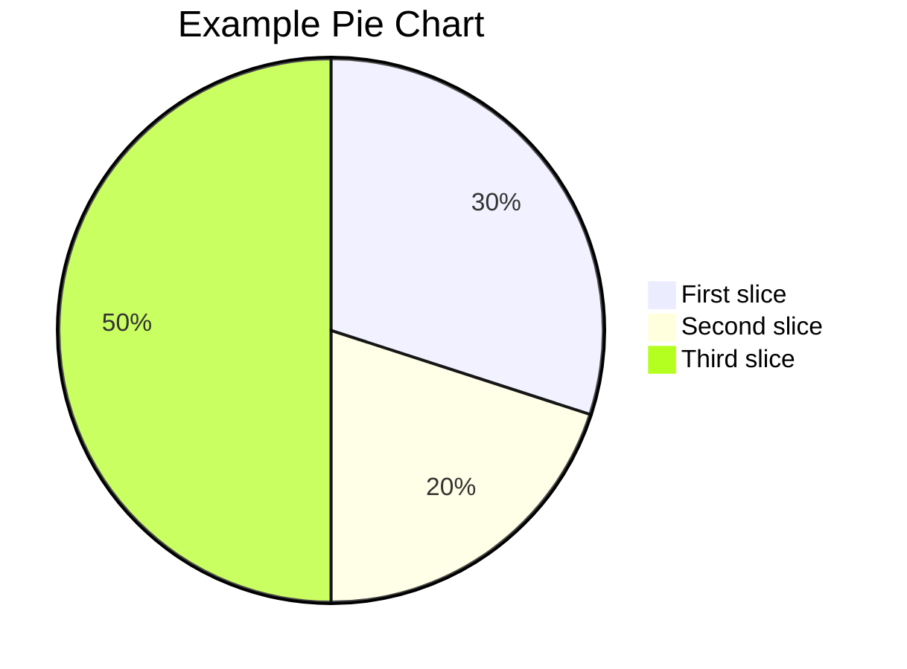

Mermaid 支持多种类型的图表

1.流程图（Flowchart）：展示过程、决策和操作流程。
```
graph LR
   A-->B;
   B-->C;
   C-->D;
```


在上面的示例中，graph 关键字用于定义一个图表，LR 参数指定图表方向为从左到右。然后，我们定义了四个形状 A、B、C 和 D，并使用 --> 符号连接它们，表示形状之间的流程顺序。

2.序列图（Sequence Diagram）：展示对象之间的交互顺序。
```
sequenceDiagram
   A->>B: Message 1
   B-->>A: Message 2
```

在上面的示例中，sequenceDiagram 关键字用于定义一个序列图。然后，我们定义了两个对象 A 和 B，并使用 ->> 和 -->> 符号连接它们，表示对象之间的消息传递顺序。消息文本可以放在冒号后面。

3.甘特图（Gantt Chart）：展示项目计划和进度。
```
gantt
   title Example Gantt Chart
   dateFormat  YYYY-MM-DD
   section Section
   task 1: 2019-01-01, 30d
   task 2: 2019-02-01, 14d
   task 3: 2019-03-01, 7d
```

在上面的示例中，gantt 关键字用于定义一个甘特图，title 用于定义图表标题，dateFormat 用于定义日期格式。然后，我们定义了一个部分 Section，并定义了三个任务 task 1、task 2 和 task 3，并指定了它们的开始日期和持续时间。


4.词云图（Class Diagram）：展示类的结构和关系。

5.饼图（Pie Chart）：展示数据占比。
```
pie
   title Example Pie Chart
   "First slice": 30
   "Second slice": 20
   "Third slice": 50
```

在上面的示例中，pie 关键字用于定义一个饼图，title 用于定义图表标题。然后，我们定义了三个数据点，分别为 "First slice"、"Second slice" 和 "Third slice"，并指定它们的数值。

捷径图（Shortcut）：简单展示快捷方式。

状态图（State Diagram）：展示对象状态的转换。

用户旅程图（Journey）：展示用户如何与应用程序交互。


Mermaid 语法高级版
    常见的关键字或符号,用于定义图表的形状、连接和标签。
    graph：定义一个图表。
    subgraph：定义一个子图表，用于将多个形状分组。
    pie：定义一个饼图。
    --> 或 -|>：定义两个形状之间的连接，--> 表示直线连接，-|> 表示垂直连接。
    --- 或 --：定义形状之间的水平或垂直线条。
    => 或 ==>：定义形状之间的带箭头的连接线，=> 表示直线箭头，==> 表示双线箭头。
    class 或 interface：定义一个类或接口形状。
    participant：定义一个参与者形状。
    note：定义一个注释形状。
    title：定义图表标题。
    style：定义形状的样式。
    click：定义一个可以单击的形状。
    loop 或 alt：定义一个循环或条件块。
    activate 或 deactivate：定义对象的激活或停用状态。
    subroutine：定义一个子程序。


