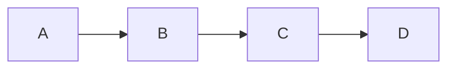
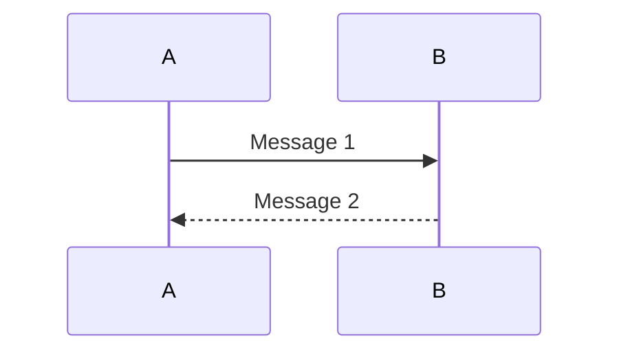
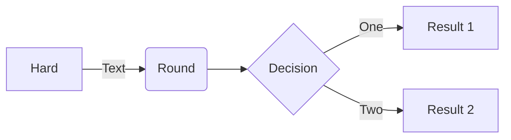

Mermaid 支持多种类型的图表

1.流程图（Flowchart）：展示过程、决策和操作流程。
```
graph LR
   A-->B;
   B-->C;
   C-->D;
```


在上面的示例中，graph 关键字用于定义一个图表，LR 参数指定图表方向为从左到右。然后，我们定义了四个形状 A、B、C 和 D，并使用 --> 符号连接它们，表示形状之间的流程顺序。

2.序列图（Sequence Diagram）：展示对象之间的交互顺序。
```
sequenceDiagram
   A->>B: Message 1
   B-->>A: Message 2
```

在上面的示例中，sequenceDiagram 关键字用于定义一个序列图。然后，我们定义了两个对象 A 和 B，并使用 ->> 和 -->> 符号连接它们，表示对象之间的消息传递顺序。消息文本可以放在冒号后面。

3.甘特图（Gantt Chart）：展示项目计划和进度。

词云图（Class Diagram）：展示类的结构和关系。

饼图（Pie Chart）：展示数据占比。

捷径图（Shortcut）：简单展示快捷方式。

状态图（State Diagram）：展示对象状态的转换。

用户旅程图（Journey）：展示用户如何与应用程序交互。
```
flowchart LR

A[Hard] -->|Text| B(Round)
B --> C{Decision}
C -->|One| D[Result 1]
C -->|Two| E[Result 2]
```


