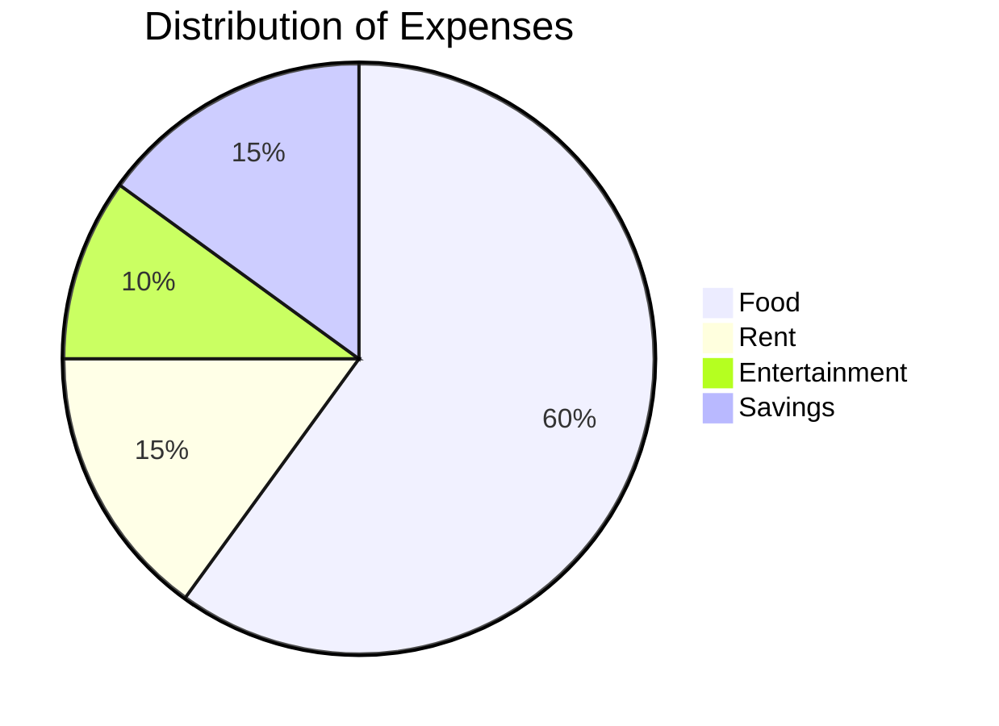
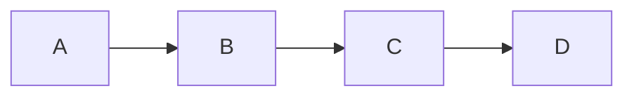
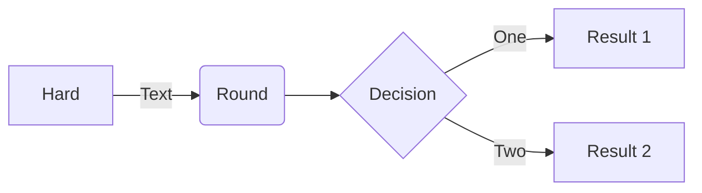

This is test.

```mermaid
pie 
    title Distribution of Expenses
    "Food":60
    "Rent":15
    "Entertainment":10
    "Savings":15
```

流程图（Flowchart)


```mermaid
graph LR
   A-->B;
   B-->C;
   C-->D;
```
```
flowchart LR

A[Hard] -->|Text| B(Round)
B --> C{Decision}
C -->|One| D[Result 1]
C -->|Two| E[Result 2]
```


```mermaid
flowchart LR

A[Hard] -->|Text| B(Round)
B --> C{Decision}
C -->|One| D[Result 1]
C -->|Two| E[Result 2]
```
